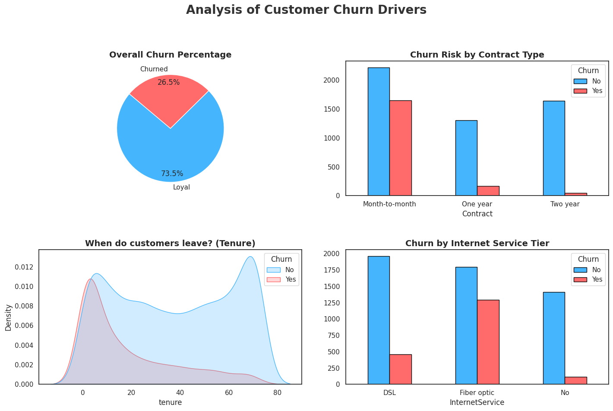

# Project Case Study: Understanding Customer Retention and Churn

## My Approach and Motivation
For this second task in my Data Science internship, I was asked to step into the role of a Retention Analyst. My goal was to move beyond simply calculating a churn rate and instead try to understand the "why" behind the numbers. In a subscription-based business like telecommunications, losing a customer is expensive, so I wanted to build a project that didn't just show data, but offered a strategy to save revenue.

I decided to handle the entire process using Python. While I could have used Excel for parts of this, I wanted to demonstrate that I can build an automated, end-to-end pipeline that cleans data, performs complex aggregations, and generates a professional dashboard in one go.

## The Data Journey and Preparation
I started with the raw `WA_Fn-UseC_-Telco-Customer-Churn.csv` file. Before I could trust my analysis, I had to deal with some common data quality issues.

During my initial exploration, I found that the `TotalCharges` column was being treated as text because of hidden blank spaces for new customers who hadn't completed a full month yet. In my script, [`churn_analysis.py`](./churn_analysis.py), I made sure to force these values to numeric and fill the gaps with zeros. This allowed me to perform accurate financial math without losing any records from the dataset.

## Methodology: Programmatic Pivot Tables
To make this analysis more robust, I programmed Python to generate specific "Pivot Tables" that I could use for deep-dives into different business segments. You can view the raw results of these aggregations in the following files:

* **Pivot_Overall_Churn.csv:** This gives me the high-level baseline of how many people are leaving versus staying.
* **Pivot_Contract.csv:** This was essential for understanding how commitment levels impact loyalty.
* **Pivot_Internet.csv:** I used this to see if specific service tiers were underperforming.

By creating these as separate files, I’ve ensured that a business stakeholder who doesn't know how to code could still open my results and understand the findings.

## My Key Findings and Insights

When I sat down to interpret the dashboard I built, a few things became very clear to me.

### Why are customers leaving?
The most significant pain point I discovered is the "New Customer Friction." Looking at the Tenure Density Plot on my dashboard, I saw a massive spike in churn within the first 6 months. This tells me the company isn't failing to keep established customers; it's failing to properly onboard new ones.

Additionally, there is a clear service issue. Customers on the premium Fiber Optic plan are leaving much faster than those on DSL. This is a red flag. Premium customers usually have higher expectations, and this data suggests we might be overpromising and underdelivering on service quality or price.

### Which segments are most at risk?
The "Month-to-Month" contract segment is the biggest flight risk. Without a long-term commitment, these customers treat the service as disposable. I also noticed that customers paying by Electronic Check churned at a much higher rate, which often points to a lack of "set it and forget it" automation in their lives, making it easier for them to cancel on a whim.

### How long do they stay?
Based on my analysis, if a customer makes it past the first year, their likelihood of leaving drops to almost zero. The "loyalty cliff" is very steep in the beginning, but once a user integrates the service into their lifestyle for 12 months or more, they become highly stable assets for the company.

## My Strategic Recommendations
If I were presenting this to a manager today, I would suggest three immediate actions:

1. **The First 90 Days Program:** We need to aggressively support new users during the first three months. This could be through proactive check-in calls or technical "health checks" to ensure their Fiber Optic connection is meeting the promised speeds.
2. **Incentivized Contract Upgrades:** We should offer a one-time "loyalty discount" to Month-to-Month users if they switch to a 1-year plan. The cost of the discount is significantly lower than the cost of acquiring a brand-new customer to replace one who left.
3. **Fiber Optic Service Audit:** We need to find out why our most expensive service has our least happy customers. I recommend a technical audit of the Fiber infrastructure and a competitive pricing review.

## Tech Stack and Reflection
This project allowed me to practice the full lifecycle of a data analyst's work. I moved from raw data cleaning to programmatic reporting and finally to strategic business advice.

* **Language:** Python 3
* **Libraries:** Pandas for data manipulation, Seaborn and Matplotlib for visual storytelling.
* **Environment:** Google Colab and Mac local environment.

By building this in Python, I’ve created a tool that can be used again. If the company gets 10,000 new rows of data tomorrow, I can run my script and have a new dashboard and new pivot tables in seconds.
